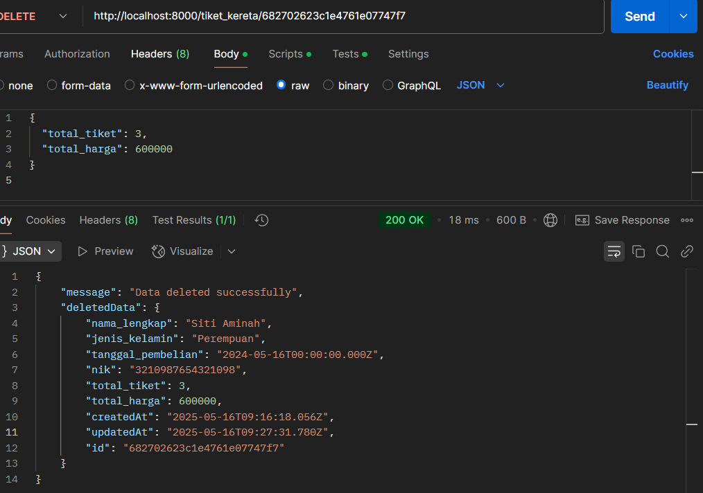
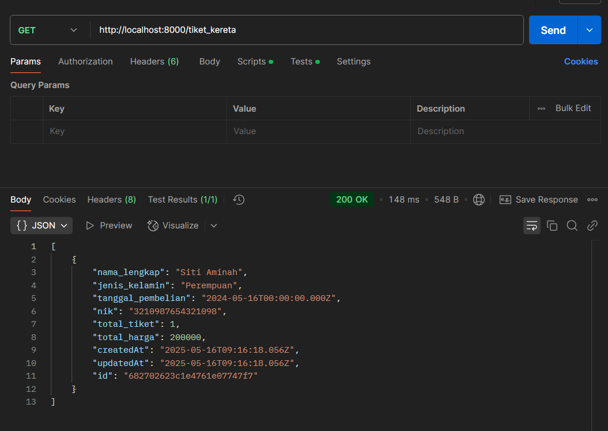
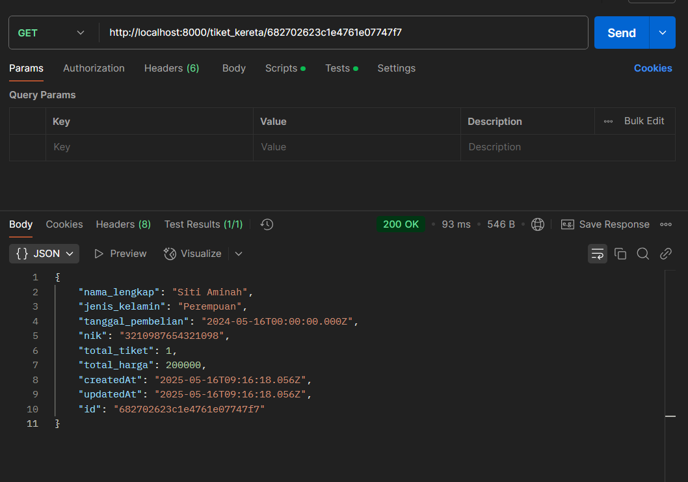
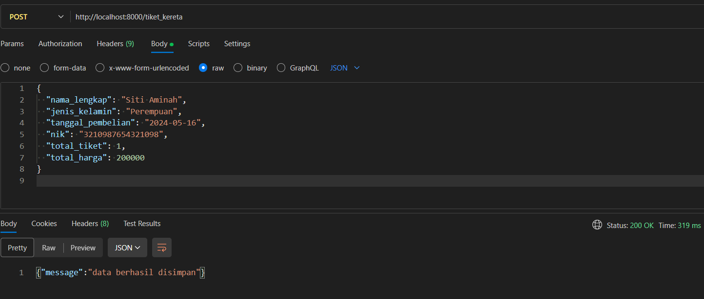
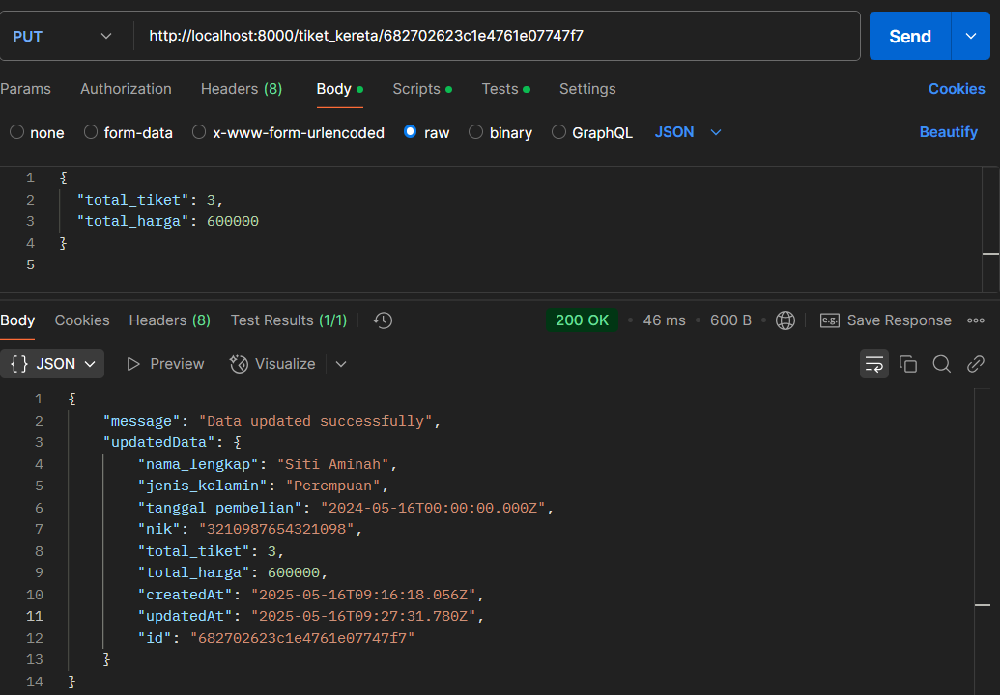

# 🚆 Tiket Kereta - Backend API

Sistem backend sederhana untuk mengelola **pemesanan tiket kereta api** menggunakan **Node.js**, **Express**, dan **MongoDB**.


## ✨ Fitur Utama

CRUD Tiket Kereta:
- Tambah Tiket
- Lihat Semua Tiket
- Lihat Tiket Berdasarkan ID
- Update Tiket
- Hapus Tiket
- Struktur data lengkap dengan tanggal pembelian & jumlah tiket
- Timestamp otomatis (`createdAt`, `updatedAt`)
- Format JSON bersih (tanpa `_id`, `__v`)

## 🛠 Tools & Teknologi
- Node.js
- Express.js
- MongoDB + Mongoose
- Nodemon (dev)
- MVC Architecture

## 📁 Struktur Proyek
```
📁final-project-sc-backend-2023
├── config
│   └── database.js
├── controllers
│   └── tiket_kereta.controllers.js
├── models
│   ├── index.js
│   └── tiket_kereta.model.js
├── routes
│   └── tiket_kereta.route.js
├── server.js
└── README.md
```


## 🛠️ Cara Menjalankan

### 1. Clone Repository
```bash
git clone https://github.com/username/tiket-kereta-api.git
cd tiket-kereta-api
```
### 2. Install Dependensi
```bash
npm install
```
### 3. Konfigurasi MongoDB
Pastikan MongoDB aktif di localhost:27017
```
// config/database.js
module.exports = {
  url: "mongodb://127.0.0.1:27017/tiket_kereta"
};
```
### 4. Jalankan Server
```
node server.js
```

Server berjalan di: http://localhost:8000


## API Reference

#### Get Tiket by ID

```http
  GET /tiket_kereta/:id

```

| Parameter | Type     | Description                |
| :-------- | :------- | :------------------------- |
| `id` | `string` | **Required**. ID tiket yang dicari |

#### ➕ Create New Tiket

```http
  POST /tiket_kereta
```
| Field               | Type     | Description              |
| ------------------- | -------- | ------------------------ |
| `nama_lengkap`      | `string` | Nama lengkap penumpang   |
| `jenis_kelamin`     | `string` | Jenis kelamin            |
| `tanggal_pembelian` | `date`   | Format: `YYYY-MM-DD`     |
| `nik`               | `string` | NIK                      |
| `total_tiket`       | `number` | Jumlah tiket yang dibeli |
| `total_harga`       | `number` | Total harga tiket        |

#### ✏️ Update Tiket by ID

```http
  PUT /tiket_kereta/:id
```
| Parameter | Type     | Description                               |
| --------- | -------- | ----------------------------------------- |
| `id`      | `string` | **Required**. ID tiket yang akan diupdate |

#### ❌ Delete Tiket by ID

```http
  DELETE /tiket_kereta/:id
```
| Parameter | Type     | Description                              |
| --------- | -------- | ---------------------------------------- |
| `id`      | `string` | **Required**. ID tiket yang akan dihapus |


### 📡 API Endpoint

| Method | Endpoint            | Deskripsi                   |
|--------|---------------------|-----------------------------|
| GET    | `/tiket_kereta`     | Ambil semua tiket           |
| GET    | `/tiket_kereta/:id` | Ambil tiket berdasarkan ID  |
| POST   | `/tiket_kereta`     | Tambah tiket baru           |
| PUT    | `/tiket_kereta/:id` | Update tiket berdasarkan ID |
| DELETE | `/tiket_kereta/:id` | Hapus tiket berdasarkan ID  |

### 📸 Preview






